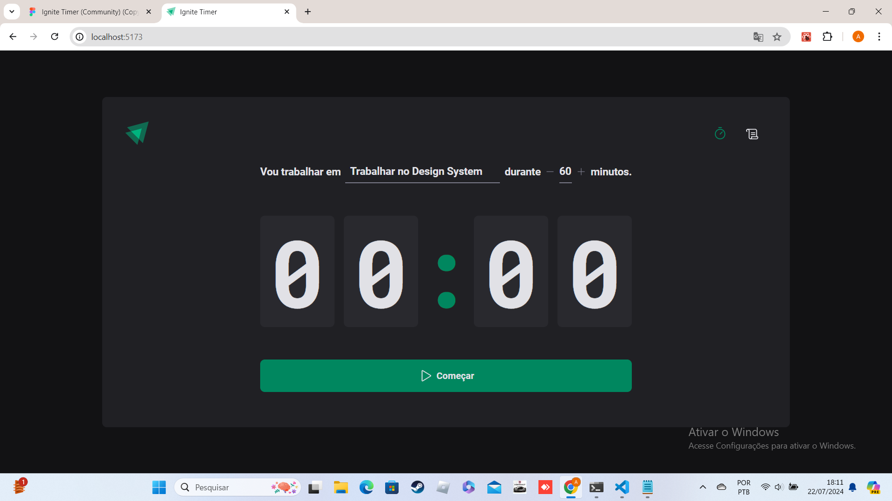
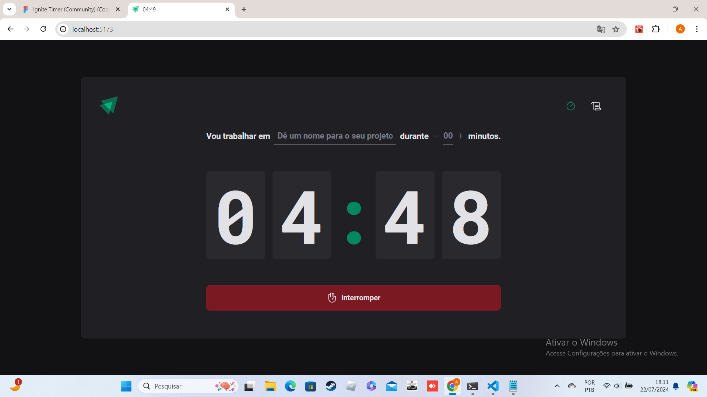
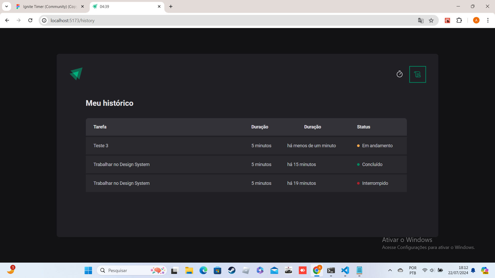

# ignite timer

Esse aplicativo foi desenvolvido no curso <a href="https://app.rocketseat.com.br/journey/react-js-2022/overview" target="_blank">ReactJS</a> , foi utilizando React, Vite e TypeScript.

|Começar tarefa|Interromper tarefa|Histórico tarefas|
|-------|------|-------|
||||

## 🔨 Funcionalidades do projeto

Esse aplicativo exibe um timer e um formulário onde é possível adicionar tarefas com tempo de 5 a 60  minutos, onde também pode ser  visto o histórico das tarefas e seus respectivos status.

## ✔️ Técnicas e tecnologias utilizadas

Lista das bibliotecas utilizadas no desenvolvimento:

- `react`
- `react-dom`
- `react-hook-form`
- `vite`
- `typescrip`
- `phosphor-react`
- `date-fns`
- `date-fns`
- `phosphor-react`
- `react-hook-form`
- `styled-components`
- `zod`
- `@hookform/resolvers`

## 🛠️ Abrir e rodar o projeto

Dentro da pasta do projeto execute npm i ou yarn para instalar as dependências e npm run dev ou yarn dev para iniciar o projeto.